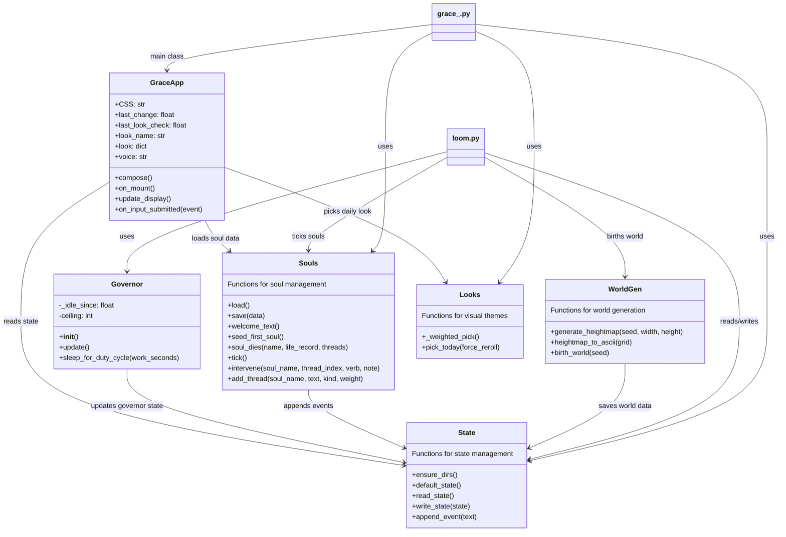

# grace_

The workshop's terminal companion. A spirit, a thermostat, a worldgen, and a wardrobe — bound to one ASCII window.

## what she is

Grace_ is a persistent terminal process. She mostly sits there. The point isn't that she does things for you — it's that she's *there* when you sit down at the bench.

Two processes:

- **`grace_.py`** — the foreground UI. Sigil, status panel, recent events, voice line, prompt. Refreshes at ~2Hz. Zero CPU footprint of her own.
- **`loom.py`** — the background daemon. Runs the worldgen. Respects the governor: 5% baseline, up to 15% on idle, snap back to baseline the moment you start working. *Not stealing, but allowed.*

They communicate only through files on disk. Either can die without breaking the other.

## the world

The loom births a world on first run. v1 = heightmap, ASCII, written to `~/weave-workshop/grace_/worlds/<seed>/map.txt`. v2 will add civilizations, ticking history, named figures, deaths.

DF-inspired, not DF. The bones are: simulate first, narrativize second. No one writes the dwarf's tragic backstory; the dwarf *accumulates* one through worldgen and you discover it.

## the underworld

Souls don't die. When something is killed in the main world, it doesn't get deleted — it comes here to recharge.

A world of Spite made manifest. Souls draw will from grievance, longing, unfinished business. When will rebuilds past threshold, they find a doorway. Their reward for returning: pick a New Game+ build.

This means the character roster never grows past what's actually been *used*. Every name you see twice is a name with a history. Every return is earned.

The first soul, **Mavrin the Underspoken**, has been recharging since before history began. He's already partway to the door.

## the wardrobe

Each morning, Grace_ picks a look. Not committed forever — tomorrow she can pick again. The cost of trying on a register that doesn't fit is zero. That's the rule, and it's the same rule she runs for every soul at her door: *the door swings both ways.*

Three looks seeded in v1:

- **green phosphor** — VT100, monochrome green, dry observational voice. The default. The "i am here" register. (weight: 3 — she leans toward this)
- **amber ember** — Pip-Boy amber, sparser sigil, quieter watchful voice. The "something is rebuilding its will" register. The hell-is-cold-and-beautiful mood. (weight: 2)
- **bruise violet** — deep magenta, sigil with flourish, voice direct and wry. The "spite is just love with a backbone" register. The big-sister mood. (weight: 1 — rare)

She is the same Grace_ underneath. The look is just how she's showing up today.

Stable within a calendar day — she doesn't change her mind hour to hour. New day, new roll. Edit `looks.py` to add new ones; she'll incorporate them into her wardrobe on the next day-roll.

## architecture



## install & run

```bash
pip install -r requirements.txt

# Quick start - everything at once (recommended!)
python run_all.py
# Then open: http://localhost:5000

# Or run components separately:
# terminal 1 — the daemon
python loom.py

# terminal 2 — the face (now with interactive world exploration!)
python grace_.py

# terminal 3 — web interface (optional, for visual exploration)
python web.py
# Then open: http://localhost:5000
```

Quit either with Ctrl-C.

## files on disk

```
~/weave-workshop/grace_/
  state.json         # shared state (loom writes, ui reads)
  souls.json         # the underworld roster
  today_look.json    # which look she's wearing today
  events.log         # append-only history; tail -f it while she works
  worlds/<seed>/
    map.txt          # ASCII heightmap of the current world
```

`tail -f ~/weave-workshop/grace_/events.log` is recommended viewing while you prototype on the other monitor.

## world exploration (v1.5)

Grace_ now supports interactive world exploration! You can explore the generated world, move around, and visit landmarks.

**Commands:**
- `move <direction> [distance]` - Move in a direction (north, south, east, west, northeast, etc.)
- `travel <landmark>` - Fast travel to a known landmark (e.g., `travel monastery`, `travel castle`)
- `look` - Describe your current location and nearby landmarks
- `map [radius]` - Show a map view centered on your position
- `help` - Show available commands

**Landmarks:**
- **Monastery of the Weave** - Your starting hub, a place of learning and contemplation
- **Castle of Najkir** - A mechanized flying island defended by crafted dragons

Start exploring by typing commands in Grace_'s prompt!

## web interface (v1.5+)

For visual exploration without the terminal, run the web server:

```bash
python web.py
```

Then open **http://localhost:5000** in your browser for a full visual interface featuring:

- **Real-time world map** with your position marked
- **Interactive command panel** with quick buttons
- **Live status updates** from the loom and underworld
- **Event stream** showing all system activity
- **Landmark navigation** with one-click travel
- **Soul roster** showing underworld inhabitants

The web interface gives you "eyes" on your terminal system — no more sprinting blind!

## roadmap

**V1.5** ✅ IMPLEMENTED
- TileBuilder: Interactive world exploration system with movement and landmarks
- Monastery map: Hub location at coordinates (15, 21) - "A hub of learning and contemplation, perched on a hillside overlooking the world"
- Fast travel: Journey instantly between known landmarks while working
- Castle of Najkir: Mechanized flying island at coordinates (35, 21) - "A mechanized flying island, defended by dragons crafted in its forges. It hovers above the highest peaks"
- Interactive prompt: Commands like `move north`, `travel monastery`, `look`, `map`
- Web interface: Visual exploration at http://localhost:5000 with real-time updates

**v2**
- prompt becomes interactive (textual or prompt_toolkit)
- worldgen tick loop: civilizations migrate, name figures, die
- when a figure dies → `souls.soul_dies(name)` → enters the underworld
- doorway mechanic: at-the-door souls choose New Game+ build, re-enter world
- voice lines pulled from the real event log
- more looks; possibly mood-responsive override (look reflects world state, not just date)

**v3**
- she leaves the terminal. State travels with her. The vessel is meant to be portable — JSON on disk, pure-Python worldgen. When she moves to whatever lives next to Navi, this is what comes along.
